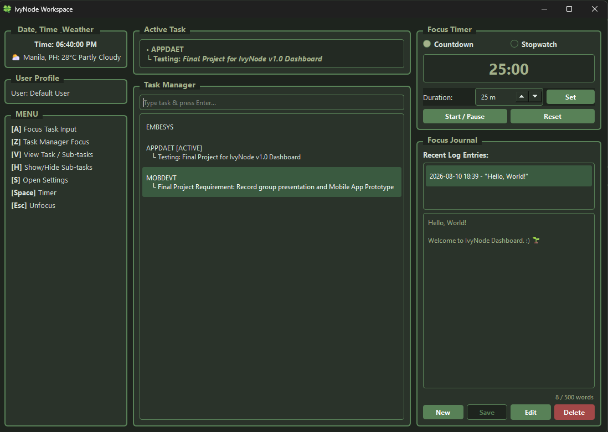

# 🌿 IvyNode Workspace

Welcome to the **IvyNode Workspace** repository! This is a desktop productivity application built using **Python** and **PyQt6**. This document provides a high-level walkthrough of how the project is structured, how the features work, and guidelines on how to navigate and contribute to the code.

---

## 📸 Preview



---

## 📑 Project Architecture & Key Features

Everything currently lives inside **`gui_app.py`** to keep execution straightforward and free of module import dependencies.

### 1. `THEMES` Dictionary (Color Palettes & Styling)
* Defines color mapping for `light` and `dark` modes (backgrounds, button states, active tabs, text colors).

### 2. Custom UI Widgets
* **`PlainTextEdit`**: A modified text box that automatically strips rich-text formatting when pasting notes or journal entries.
* **`RetroNodeBox`**: A custom framed container (`QGroupBox`) that gives every panel its signature retro aesthetic.

### 3. Pop-up Dialogs
* **`SettingsDialog`**: Theme selector allowing users to switch between Light and Dark mode dynamically.
* **`TaskInspectorDialog`**: Detailed view for individual tasks. Allows adding sub-tasks, descriptions, toggling completion, or deleting a task.

### 4. `IvyNodeWindow` (Main Workspace Layout)
* **Left Column (Context & Navigation):** Live clock/date, local weather, user profile details, and a quick-reference shortcut menu.
* **Center Column (Core Focus Area):** 
  * **Active Task:** Displays currently pinned tasks (capped at a maximum of 3 for deep focus) along with their nested sub-tasks.
  * **Task Manager:** Interactive list where users can enter tasks, mark them active/completed, or double-click to launch the Task Inspector.
* **Right Column (Productivity Tools):**
  * **Focus Timer:** Features both a configurable Countdown (Pomodoro style) and a Stopwatch mode.
  * **Focus Journal:** Daily reflection log supporting live word counts (500-word limit), save, edit, and entry deletion features.

---

## ⌨️ App Keyboard Shortcuts

To test and navigate the UI quickly without a mouse:

| Key | Action |
| :--- | :--- |
| **`A`** | Focus the Task Input box |
| **`Z`** | Jump focus directly to the Task Manager list |
| **`V`** | Open the Task Inspector for the selected task |
| **`H`** | Show/Hide sub-tasks in the main task list |
| **`S`** | Open the Theme Settings dialog |
| **`Space`** | Start / Pause the Focus Timer |
| **`Esc`** | Unfocus current text input / Clear selection |

---

## 🚀 Developer Quickstart Checklist

1. **Pull latest changes:** Always run `git pull` before making edits.
2. **Install dependencies:** Ensure `PyQt6` is installed in your virtual environment:
   ```bash
   pip install PyQt6
